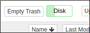

# Empty Trash

Empty Trash extension for jupyter notebook.

It was created because there's a conflict around deleting directories
and `quota`'d home-directories:

1. Non-empty directories cannot be deleted - you have to delete
   every file & folder within the directory to be eble to delete it.
2. non-empty directories can be _deleted_ by setting
   `c.FileContentsManager.delete_to_trash = True`
   however this means the files are moved into a hidden folder
3. This hidden folder cannot be accessed via the UI (you need to

      * Open a terminal, and
      * know where to look
      
   to delete the files)
4. The hidden folder is in the users _home directory_, so counts towards
their `quota` - but they have no [obvious] way to get rid of it.

It is a small extension for Jupyter Notebooks running in a docker notebook, and
provides two functions

1. It displays current disk usage, in line with `nbresuse`, and
2. It allows the user to delete trash

Both _buttons_ are displayed in the dashboard [or **tree**] page,
refreshing every 5s.



Reminder: This version is specific from notebooks running in docker containers.

## Installation

You currently install this package by cloning from GitHub. In your dockerfile, add:

```bash
USER root
WORKDIR /srv
RUN git clone --depth 1 https://github.com/edina/nb_empty_trash
RUN pip install /srv/empty-trash/ \
    && jupyter nbextension install --sys-prefix --py empty_trash \
    && jupyter nbextension enable empty_trash --py --sys-prefix \
    && jupyter serverextension enable --py empty_trash --sys-prefix

USER $NB_USER
WORKDIR $HOME
```
(swap the `RUN git ...` command for the `COPY . empty_trash` command when developing locally)

## Configuration

### Disk Usage

Empty Trash displays Disk usage, reporting current & maximum values - and
directly copies what `nbresuse` does (down to using the same configuration
variables).

The `disk_maximum` is defined as the total byte size for the disk partition
the directory is on, and that directory defaults to `/home/joyan`, but can
be defined (as outlined for `memory` and `cpu` above) using the evironment
variable `DISK_DIR` or the config variable `disk_dir` 

An artificial limit can be set as above, using either the `DISK_LIMIT`
environment variable or the config element `disk_limit`. This limit needs to
be set as an integer in Bytes.

If `disk_limit` is unset, it reports `disk_maximum`

### Trash Size

The `Empty Trash` tooltip displays the sum-total of file-sizes in the trash
folder.

The directory defaults to `$HOME/.local/share/Trash/`, but can be defined
using the evironment variable `TRASH_DIR` or the config variable `trash_dir` 

## Contributing

If you would like to contribute to the project, please read [`CONTRIBUTING.md`](CONTRIBUTING.md).
The `CONTRIBUTING.md` file explains how to set up a development installation
and how to run the test suite.
